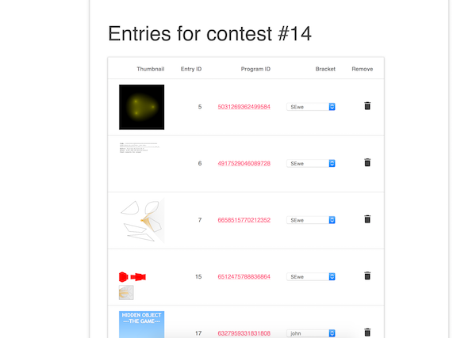

# kacscjs
A contest judging system for the @Khan Academy Computer Programming section
Backend: Play Framework
Frontend: Gulp + MDLite

### Testing the app locally
1. Make sure you have [Node](https://nodejs.org/en/download/), JDK, and [SBT](https://www.scala-sbt.org/1.0/docs/Setup.html) installed
2. `git clone https://github.com/EthanLuisMcDonough/kacscjs.git`
3. `cd kacscjs`
4. `npm install`
5. `npm run build`
6. Set up a MySQL server and run schema.sql
7. Open SBT by running `sbt`
8. `playGenerateSecret`
9. Open conf/application.conf
 and set `play.http.secret.key` to the generated secret's value
10. Finish filling out all other fields in application.conf that are set to `"changeme"`
11. `run` to run the app in dev mode

### Screenshots

